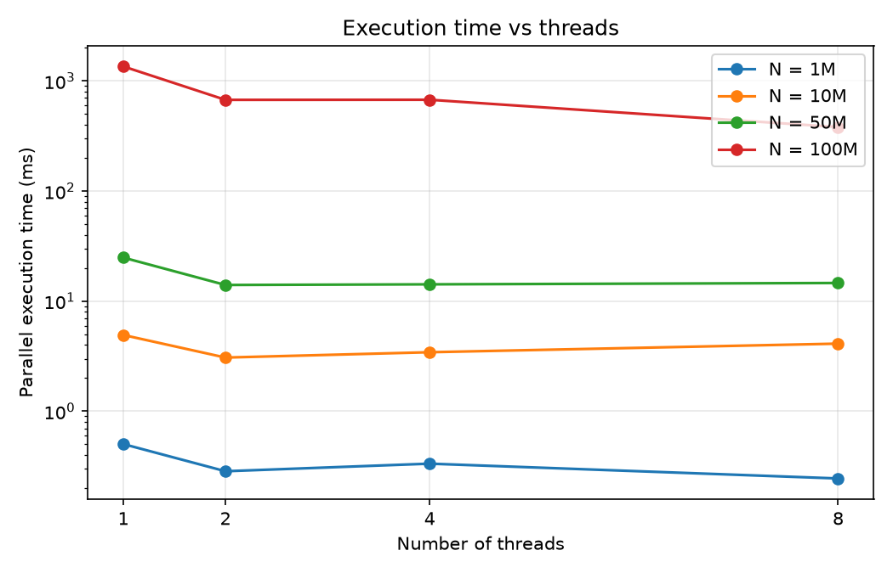
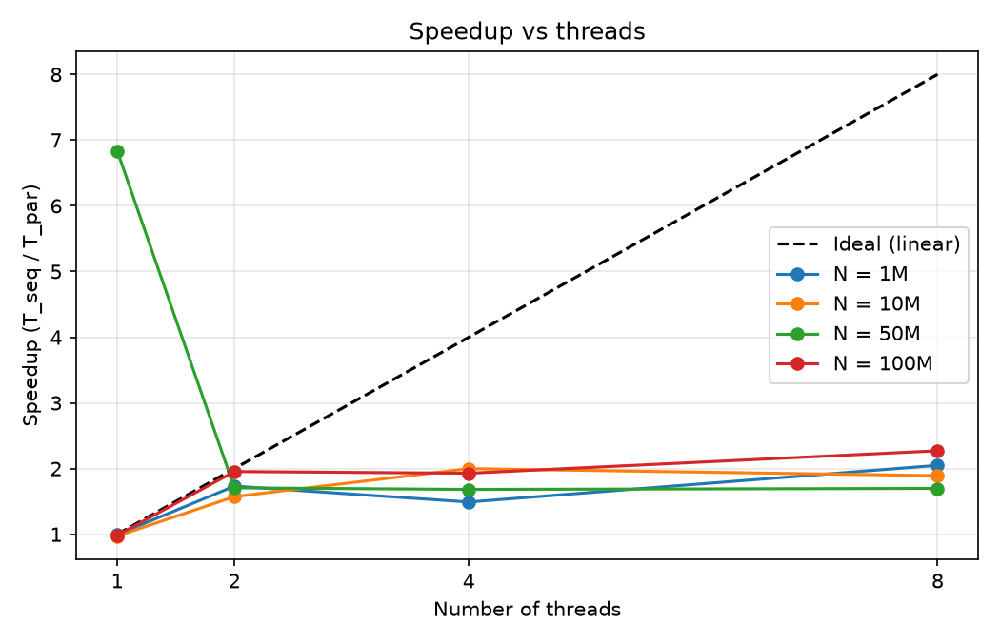
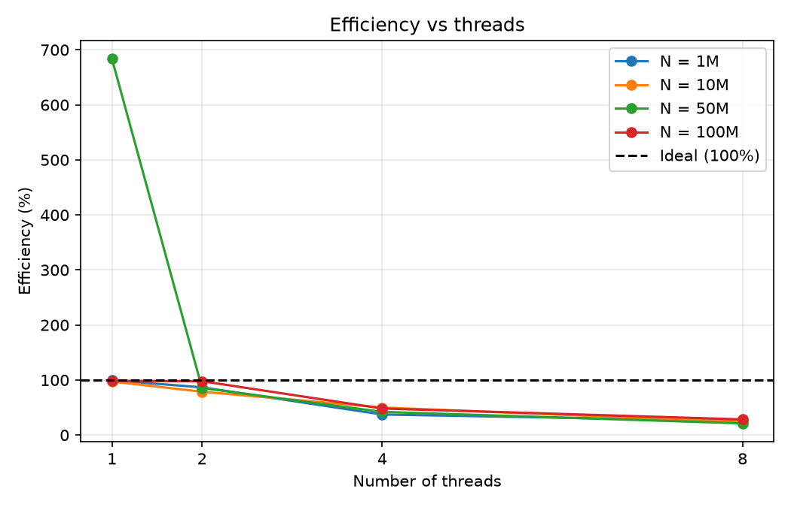

# Parallel Vector Addition using OpenMP

**Team 1 – Parallel Computing Mini-Project (Lab Evaluation)**

## Team Members
| Name | USN / Roll No. | Role |
|------|----------------|------|
| _Bhoomi B_ | _110_ | Implementation |
| _Sneha S_ | _131_ | Experiments & graphs |
| _Sanket U_ | _103_ | Report & presentation |

## Objective
Add two large vectors, `C[i] = A[i] + B[i]`, using multiple OpenMP threads, and
analyse execution time, speedup and efficiency against the sequential version
for different vector sizes and thread counts.

## Folder Structure
```
lab-eval-parallel-vector-addition/
|-- README.md
|-- src/vector_add.c        sequential + OpenMP parallel code, timing, verification
|-- data/README.md          data is generated inside the program (no input file)
|-- run_experiments.sh      runs all sizes x thread counts, writes results/results.csv
|-- plot_results.py         draws the graphs from results.csv
|-- results/results.csv     raw timing output
|-- graphs/                 execution_time, speedup, efficiency, time_vs_size plots
`-- presentation/           final PPT
```

## Requirements
- GCC with OpenMP support (`gcc -fopenmp`)
- Python 3 with `pandas` and `matplotlib` (for graphs)

## How to Build and Run
```bash
# compile
gcc -O2 -fopenmp src/vector_add.c -o vector_add -lm

# single run: N = 10 million elements, 4 threads, best of 5 repeats
./vector_add 10000000 4 5

# full experiment set + graphs
bash run_experiments.sh
python3 plot_results.py
```
Output format: `N,threads,seq_time_s,par_time_s,speedup,efficiency`

## Results Summary
_Machine: <your CPU>, <cores> cores, <RAM>, GCC <version>_

| N | Threads | Seq time (ms) | Par time (ms) | Speedup | Efficiency |
|---|---------|---------------|---------------|---------|------------|
| _fill from results/results.csv_ | | | | | |

**Key observations**
- Speedup grows with threads up to the number of physical cores, then flattens.
- Vector addition is memory-bandwidth bound (1 add per 24 bytes moved), so speedup
  stops well below the ideal line once memory bandwidth is saturated.
- Using more threads than cores adds scheduling overhead and lowers efficiency.

## Graphs



